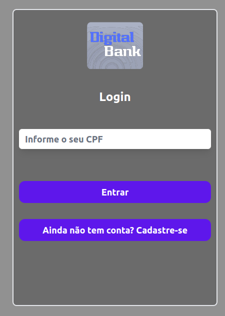
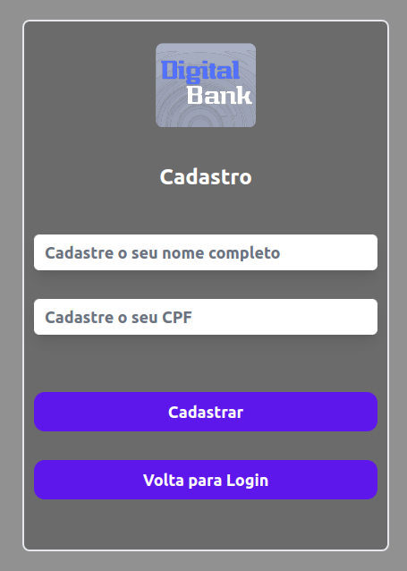
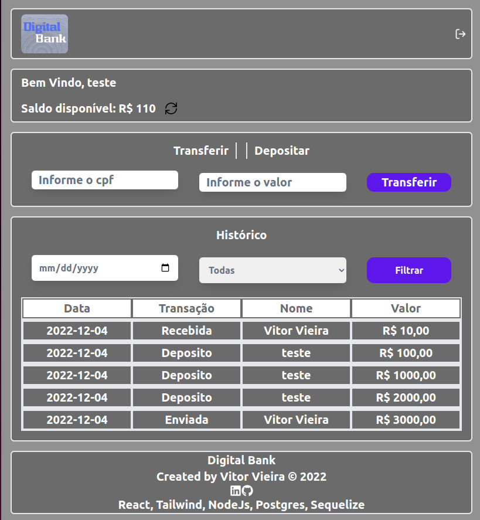
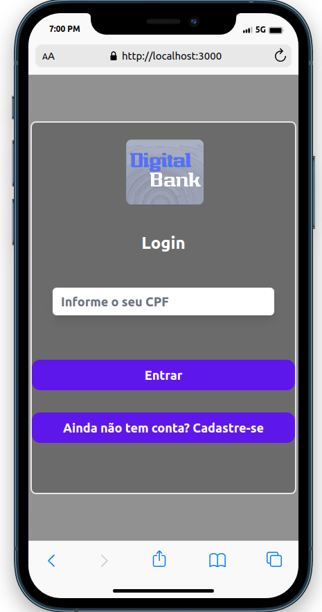
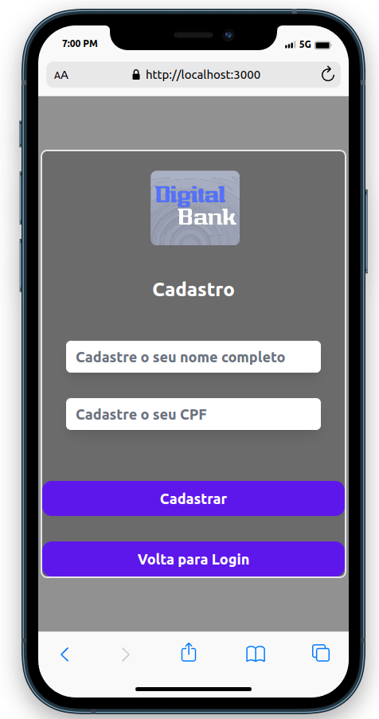
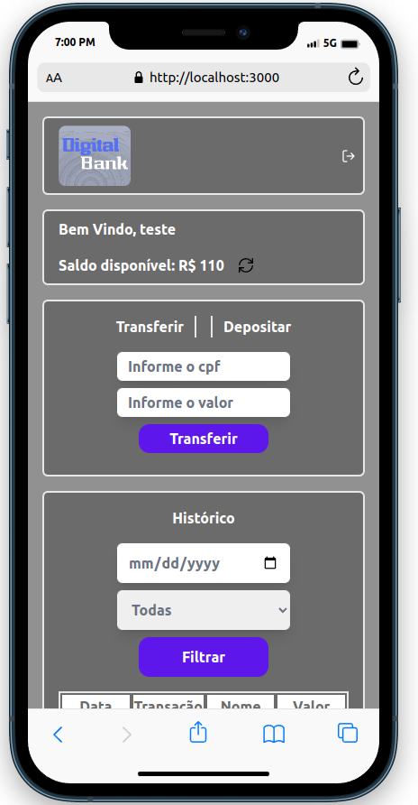

# Aplicação Full Stack - Digital-bank 
###### by _[Vitor Vieira](https://www.linkedin.com/in/vtorvieira/)_

## Resumo BackEnd

Aplicação consiste em uma API que simula transação de transferência e deposito, onde é possível fazer login com **username** e **password**, cadastrar novos usuários, visualizar o seu saldo, transferir dinheiro para outros usuários, depositar dinheiro para você mesmo e visualizar o extrato das transações, podendo filtrar por data e tipo de operação (Enviada / Recebida / Deposito).
A **API** foi desenvolvida em **NodeJS**, **Express** e **PostgreSQL**. Possui uma arquitetura **MSC** e ORM **Sequelize**. Também possui autenticação com **JWT** e criptografia com **bcrypt**, e tratamento de erros com **express-async-errors**.

## Resumo FrontEnd

Possui uma interface que consome a API desenvolvida no BackEnd, onde é possível fazer login com e visualizar o saldo, transferir dinheiro para outros usuários, depositar dinheiro para você mesmo e visualizar de transações, podendo filtrar por data e tipo de operação (enviada/recebida/deposito).
Foi desenvolvido em **ReactJS**. A estilização foi feita com **Tailwind**, e **Axios** para fazer as requisições à API.

## Como executar

Você precisa ter instalado as seguintes ferramentas: Git, Docker e Docker Compose

Será necessário que a porta 3000 e 4001 estejam disponíveis para a aplicação, Postgresql usará a porta 5432.

1 - Clone o repositório 
```
git@github.com:VtorVieira/digital-bank.git
```
2 - Entre na pasta `frontend` e execute o comando abaixo:
```
npm i // para instalar as dependencias
```
3 - Entre na pasta `backend` e execute o comando abaixo:
```
npm i // para instalar as dependencias
```
4 - Voltar para a pasta `digital-bank` e suba o dockercompose. Após rodar o comando, aguarde um pouco que a aplicação irá ficar disponivel nas seguintes rotas:

  `- Front End: http://localhost:3000`

  `- Back End: http://localhost:4001`
  
## Testes

### Aplicado testes unitários na camada do front utilizando **Jest**

Entre na pasta `frontend` e execute o comando abaixo:
```
npm run test
```
  
## Rotas Api

#### Login
```
http://localhost:4001/signin
```

#### Cadastro
```
http://localhost:4001/signup
```

#### Consultar Saldo
```
http://localhost:4001/account/balance
```

#### Realizar Transferência
```
http://localhost:4001/account/transfer
```

#### Realizar Deposito
```
http://localhost:4001/account/deposit
```

#### Consulta das transações para montar a tabela
```
http://localhost:4001/transactions
```

## Regra de Negócio para Transações

<ul>
  <li>Deposito só é permitido para o proprio usuário, sendo necessário informar apenas o valor, tendo um limite de até R$ 2000.</li>
  <li>Só é permitido transferir entre os usuários da aplicação, sendo assim, caso queira testar, será necessário cadastrar dois usuários*</li>
  <li>Para realizar a primeira transação de transferência, após existir dois usuários, é necessário depositar um valor na conta!</li>
  <li>Para apresentar o saldo disponível após uma transação (transferência/deposito), é necessário clicar no icone de atualizar</li>
</ul>

*esta subindo um usuário teste para facilitar a utilização. CPF: 01234567890

## Preview da Aplicação

<p align="center">
Tela de Login / Tela de Cadastro / Tela Principal
</p>
<p align="center">



</p>
<hr />

<p align="center">
Versão Mobile
</p>
<p align="center">



</p>
<hr />
